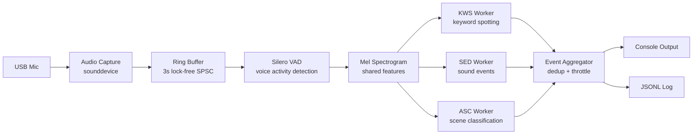

# 🎙️ audio-edge

**Multi-Task Real-Time Audio Intelligence for Jetson Edge Devices**

[](LICENSE)
[](https://www.python.org/)
[](https://github.com/lightxiu/audio-edge/actions/workflows/lint.yml)
[](https://github.com/lightxiu/audio-edge/actions/workflows/test.yml)

A real-time audio understanding pipeline that runs **three inference tasks simultaneously** on a Jetson Orin NX — Keyword Spotting, Sound Event Detection, and Audio Scene Classification — all optimized with TensorRT.

---

## ✨ Features

- 🎤 **Keyword Spotting (KWS)** — Wake-word and command detection with `<100ms` latency
- 🔔 **Sound Event Detection (SED)** — 521 AudioSet classes (siren, gunshot, glass break, dog bark...)
- 🏠 **Audio Scene Classification (ASC)** — Indoor/outdoor, office/street/cafe/station detection
- ⚡ **Real-Time Streaming** — End-to-end pipeline with lock-free ring buffer
- 🚀 **TensorRT FP16** — 2-5x speedup on Jetson Orin NX GPU
- 🧵 **Multi-Threaded** — Capture → VAD → KWS/SED/ASC run concurrently
- 🔌 **Modular Backend** — ONNX Runtime (dev) → TensorRT (production)
- 📊 **Built-in Benchmarking** — p50/p95/p99 latency tracking
- 🖥️ **Cross-Platform** — Develop on Windows/Linux, deploy on Jetson

---

## 🏗️ Architecture



### Thread Model

| Thread | Role | Priority |
|--------|------|----------|
| Audio Capture | PortAudio callback → RingBuffer | HIGH (never blocks) |
| VAD Processor | Voice detection + feature extraction | MEDIUM |
| Background Inference | SED (1s) + ASC (3s) accumulation | LOW |
| Main | Event loop, keyboard handling | LOW |

### Models

| Task | Model | Size | Latency Target | License |
|------|-------|------|---------------|---------|
| VAD | Silero VAD v5 | 2 MB | <5 ms | MIT |
| KWS | sherpa-onnx Zipformer | ~10 MB | <30 ms | Apache 2.0 |
| SED | YAMNet | ~15 MB | <50 ms | Apache 2.0 |
| ASC | AST-finetuned-audioset | ~340 MB | <200 ms | MIT |

---

## 🚀 Quick Start

### Prerequisites

- Python 3.10+
- Audio input device (USB mic, built-in mic, or loopback)
- **Optional:** NVIDIA Jetson Orin NX for TensorRT acceleration

### Install

```bash
git clone https://github.com/lightxiu/audio-edge.git
cd audio-edge
pip install -e .
```

### Download Models

```bash
# Download required models (Silero VAD)
python scripts/download_models.py

# List available models
python scripts/download_models.py --list
```

### Run

```bash
# Quick test — check your microphone
python scripts/list_devices.py

# Live RMS meter
python scripts/test_audio.py

# Run the full pipeline (mock models if real ones not available)
python -m src.cli run

# Run for 10 seconds with mock audio (for testing)
python -m src.cli run --mock --duration 10
```

### CLI Commands

```bash
# Full pipeline
python -m src.cli run --config configs/windows_dev.yaml

# List audio devices
python -m src.cli list-devices

# Test microphone
python -m src.cli test-audio --device "USB"
```

---

## 🖥️ Jetson Orin NX Deployment

### Hardware Setup

```
Jetson Orin NX
  └─ USB Sound Card
       └─ Headset with Microphone
```

### 1. Install Dependencies

```bash
# System packages
sudo apt update && sudo apt install -y portaudio19-dev python3-pip

# Python packages
cd ~/audio-edge
pip install -e .
```

### 2. Set Performance Mode

```bash
sudo nvpmodel -m 0          # MAXN mode
sudo jetson_clocks           # Lock clocks to max
```

### 3. Download Models & Build TensorRT Engines

```bash
python scripts/download_models.py
python scripts/build_trt_engines.py
```

### 4. Find Your USB Sound Card

```bash
python scripts/list_devices.py
# Note the device name (e.g., "USB Audio Device")

# Edit config to use it
# configs/jetson_trt.yaml → audio.device: "USB Audio Device"
```

### 5. Run

```bash
python -m src.cli run --config configs/jetson_trt.yaml
```

### 6. (Optional) Run as Systemd Service

```ini
# /etc/systemd/system/audio-edge.service
[Unit]
Description=Audio Edge Inference Pipeline
After=network.target sound.target

[Service]
Type=simple
User=jetson
WorkingDirectory=/home/jetson/audio-edge
ExecStart=/usr/bin/python3 -m src.cli run --config configs/jetson_trt.yaml
Restart=always
RestartSec=10

[Install]
WantedBy=multi-user.target
```

```bash
sudo systemctl enable --now audio-edge.service
```

---

## 📊 Benchmarks

Run on Jetson Orin NX with TensorRT FP16:

```bash
python scripts/benchmark.py --runs 1000 --output bench_results.json
```

### Expected Performance

| Model | Backend | p50 | p95 | p99 | Speedup vs ONNX |
|-------|---------|-----|-----|-----|-----------------|
| VAD | ONNX CPU | <5ms | <10ms | <15ms | — (CPU is optimal) |
| KWS | TensorRT FP16 | <10ms | <20ms | <30ms | 3-5x |
| SED | TensorRT FP16 | <20ms | <40ms | <60ms | 2-3x |
| ASC | TensorRT FP16 | <100ms | <200ms | <300ms | 2-4x |

*Benchmarks vary based on JetPack version and power mode. Above numbers on Orin NX 16GB with MAXN mode.*

---

## 📁 Project Structure

```
audio-edge/
├── src/
│   ├── capture/          # Audio capture (sounddevice + ring buffer)
│   ├── features/         # Mel spectrogram, MFCC extraction
│   ├── models/           # VAD, KWS, SED, ASC wrappers
│   ├── pipeline/         # Orchestrator, scheduler, aggregator
│   ├── output/           # Console, JSONL backends
│   └── utils/            # Config, logging, metrics
├── configs/              # YAML configs (default, windows, jetson)
├── scripts/              # Utility scripts (download, benchmark, deploy)
├── tests/                # pytest test suite
└── docs/                 # Architecture + deployment docs
```

---

## 🧪 Testing

```bash
# Run all tests
pytest tests/ -v

# Run specific test file
pytest tests/test_vad.py -v

# With coverage
pytest tests/ --cov=src --cov-report=term
```

---

## 🛠️ Development

### Local Dev (Windows/Linux)

```bash
pip install -e ".[dev]"
pre-commit install
```

### Adding a New Model

1. Subclass `BaseModel` in `src/models/`
2. Implement `_load_model()` and `_infer()`
3. Register in `src/pipeline/orchestrator.py`
4. Add config section in `configs/default.yaml`
5. Add to `src/models/model_loader.py` registry

---

## 🗺️ Roadmap

- [x] Phase 1: Audio capture + ring buffer
- [x] Phase 2: Silero VAD + mel spectrogram
- [x] Phase 3: KWS + pipeline orchestration
- [x] Phase 4: SED + ASC multi-task inference
- [x] Phase 5: TensorRT engine builder + benchmarks
- [ ] Phase 6: Real-model testing on Jetson hardware
- [ ] MQTT output for IoT integration
- [ ] WebSocket dashboard for real-time visualization
- [ ] Custom keyword fine-tuning scripts
- [ ] C++ inference backend option

---

## 📄 License

MIT — see [LICENSE](LICENSE) for details.

### Third-Party Models

| Model | License |
|-------|---------|
| Silero VAD | MIT |
| sherpa-onnx | Apache 2.0 |
| YAMNet | Apache 2.0 |
| AST | MIT |

---

## 🙏 Acknowledgments

- [Silero VAD](https://github.com/snakers4/silero-vad) — Voice activity detection
- [sherpa-onnx](https://github.com/k2-fsa/sherpa-onnx) — KWS + ASR toolkit
- [YAMNet](https://tfhub.dev/google/yamnet/1) — Sound event detection
- [NVIDIA TensorRT](https://developer.nvidia.com/tensorrt) — Inference optimization
